# MBM: Multi tenant Booking Manager

Plataforma de reservas multi tenant para negocios de servicios. Este repositorio contiene la base de datos, la API, el frontend y la documentación del proyecto SC-404.

Resumen

MBM es una plataforma de reservas multi tenant para negocios de servicios. La base de datos es el eje principal y el proyecto incluye API, frontend y docker para el flujo completo de reservas, administración y seguimiento.

## Índice

- [Integrantes](#integrantes)
- [Documentación](#documentación)
- [Estructura rápida](#estructura-rápida)

## Integrantes

- Handel Simón Enriquez Acuña
- Isaac Chaves Zumbado
- Jeferson Andrew Fuentes García
- Luna Delgado Durango
- Melannie Yeonsuk Campos Arias

## Documentación

**Curso / base de datos (fuente de verdad para la entrega):**

- [docs/overview.md](docs/overview.md) visión general, objetivos, alcance, actores y requerimientos
- [docs/database-and-sql-implementado.md](docs/database-and-sql-implementado.md) base de datos **construida** (as-built): 15 tablas, ER, ciclo de vida, seed, e inventario de procedures/vistas/funciones/triggers
- [docs/sql-signatures.md](docs/sql-signatures.md) referencia de stored procedures, vistas, funciones, triggers y códigos THROW
- [docs/rename-map.csv](docs/rename-map.csv) equivalencia de nombres inglés / modelo (con ñ) / físico ASCII
- [docs/plan-and-delivery.md](docs/plan-and-delivery.md) entregables, cronograma, demo y matriz de requisitos R1-R6
- [docs/domain-questions.md](docs/domain-questions.md) decisiones de dominio que guiaron el diseño
- [docs/database-and-sql.md](docs/database-and-sql.md) propuesta de diseño original (referencia histórica; los nombres en inglés quedaron superados por la versión construida)

**Aplicación (API + frontend):**

- [docs/api-handover.md](docs/api-handover.md) handover de la API: convenciones, tabla completa de endpoints, ejemplos curl, estados y pendientes de cableado
- [docs/arquitectura-visual.md](docs/arquitectura-visual.md) arquitectura visual, puertos, secuencia de login JWT y bootstrap
- [docs/frontend-map.md](docs/frontend-map.md) mapa de rutas frontend y su relación con endpoints

**Otros:**

- [database/docs/PASSWORDS.md](database/docs/PASSWORDS.md) credenciales de desarrollo (seed data)
- [docs/archive/](docs/archive/) documentos históricos superados (no son fuente de verdad)

## Estructura rápida

- [apps/frontend](apps/frontend) aplicación Next.js
- [apps/api](apps/api) backend FastAPI
- [database](database) scripts y recursos de base de datos
- [infra](infra) infraestructura y contenedores
- [docs](docs) documentación completa

## Puesta en marcha

### Requisitos

- Docker Desktop (o Docker Engine + Docker Compose v2).

### Un solo comando

```bash
docker compose up --build
```

El compose trae valores por defecto para desarrollo, así que no se necesita configuración previa. La primera vez, un servicio de inicialización ejecuta en orden los scripts `database/scripts/01` a `07` (esquema, seed, procedimientos, funciones, vistas y triggers); en arranques posteriores detecta que la base ya existe y no la vuelve a cargar.

Para detener o reiniciar:

```bash
docker compose down       # detiene y conserva los datos
docker compose down -v    # borra la base para empezar desde cero
```

Configuración opcional: copiar `.env.example` a `.env` para cambiar contraseñas, el `JWT_SECRET` o los puertos. La base queda expuesta en el host en el puerto `11433` (para DataGrip, DBeaver o SSMS), de modo que no choca con un SQL Server local en `1433`.

Para cargar la base fuera de Docker, contra un SQL Server propio:

```bash
.\scripts\setup-db.ps1     # Windows (principal)
bash scripts/setup-db.sh   # macOS / Linux
```

### URLs locales

| Servicio | URL |
| --- | --- |
| Frontend | http://localhost:3000 |
| API | http://localhost:8000 |
| Documentación interactiva de la API (Swagger) | http://localhost:8000/docs |
| Especificación OpenAPI | http://localhost:8000/openapi.json |
| Healthcheck | http://localhost:8000/health |

### Credenciales de demo

No se documentan contraseñas en claro en este README. Ver [database/docs/PASSWORDS.md](database/docs/PASSWORDS.md) para el detalle completo del seed data (dueños de negocio, superadmins, y el owner de prueba recomendado para demo: dominio `barberia-el-colocho`).

### Correr los tests de la API

```bash
cd apps/api
python3 -m venv .venv
.venv/bin/pip install -e ".[dev]"

# unitarios (96 tests, sin dependencia de base de datos)
.venv/bin/pytest tests/unit -q

# integración (65 tests, requiere SQL Server corriendo con el schema aplicado)
.venv/bin/pytest tests/integration -q
```

Más detalle de variables de entorno, arquitectura por capas y lint/type-check en [apps/api/README.md](apps/api/README.md).

## Modelo de datos: visión general

Nombres de tablas y columnas en español ASCII (los físicos, usados por los scripts en `database/scripts/`). Equivalencia completa inglés/español en [docs/rename-map.csv](docs/rename-map.csv).

```mermaid
erDiagram
    tipos_negocios {
        int tipo_negocio_id PK
        nvarchar_100 nombre "NOT NULL UNIQUE"
        nvarchar_500 descripcion "NULL"
        bit activo "NOT NULL DEFAULT 1"
    }
    estados_dominios {
        int dominio_estado_id PK
        nvarchar_50 nombre "NOT NULL UNIQUE"
        nvarchar_200 descripcion "NULL"
    }
    superadmins {
        int superadmin_id PK
        nvarchar_100 nombre "NOT NULL"
        nvarchar_100 apellido_1 "NOT NULL"
        nvarchar_100 apellido_2 "NULL"
        nvarchar_254 correo "NOT NULL UNIQUE"
        nvarchar_512 contrasena_encriptada "NOT NULL"
        bit activo "NOT NULL DEFAULT 1"
        datetime2 creado_en "NOT NULL DEFAULT SYSUTCDATETIME"
        datetime2 actualizado_en "NOT NULL DEFAULT SYSUTCDATETIME"
    }
    dominios {
        int dominio_id PK
        int tipo_negocio_id FK "NOT NULL"
        int dominio_estado_id FK "NOT NULL"
        nvarchar_200 nombre "NOT NULL"
        nvarchar_100 slug "NOT NULL UNIQUE"
        nvarchar_254 correo "NOT NULL"
        nvarchar_30 telefono "NULL"
        nvarchar_max descripcion "NULL"
        nvarchar_500 logo_url "NULL"
        nvarchar_500 mensaje_publico "NULL"
        bit activo "NOT NULL DEFAULT 1"
        datetime2 creado_en "NOT NULL DEFAULT SYSUTCDATETIME"
        datetime2 actualizado_en "NOT NULL DEFAULT SYSUTCDATETIME"
    }
    duenos_de_dominios {
        int dueno_id PK
        int dominio_id FK "NOT NULL"
        nvarchar_100 nombre "NOT NULL"
        nvarchar_100 apellido_1 "NOT NULL"
        nvarchar_100 apellido_2 "NULL"
        nvarchar_254 correo "NOT NULL"
        nvarchar_512 contrasena_encriptada "NOT NULL"
        nvarchar_30 telefono "NULL"
        bit activo "NOT NULL DEFAULT 1"
        datetime2 creado_en "NOT NULL DEFAULT SYSUTCDATETIME"
        datetime2 actualizado_en "NOT NULL DEFAULT SYSUTCDATETIME"
    }
    clientes {
        int cliente_id PK
        int dominio_id FK "NOT NULL"
        nvarchar_100 nombre "NOT NULL"
        nvarchar_100 apellido_1 "NOT NULL"
        nvarchar_100 apellido_2 "NULL"
        nvarchar_254 correo "NOT NULL"
        nvarchar_30 telefono "NOT NULL"
        nvarchar_500 notas "NULL"
        datetime2 creado_en "NOT NULL DEFAULT SYSUTCDATETIME"
        datetime2 actualizado_en "NOT NULL DEFAULT SYSUTCDATETIME"
    }
    categorias_servicios {
        int categoria_id PK
        int dominio_id FK "NOT NULL"
        nvarchar_150 nombre "NOT NULL"
        nvarchar_500 descripcion "NULL"
        bit activo "NOT NULL DEFAULT 1"
        datetime2 creado_en "NOT NULL DEFAULT SYSUTCDATETIME"
        datetime2 actualizado_en "NOT NULL DEFAULT SYSUTCDATETIME"
    }
    servicios {
        int servicio_id PK
        int dominio_id FK "NOT NULL"
        int categoria_id FK "NOT NULL"
        nvarchar_200 nombre "NOT NULL"
        nvarchar_max descripcion "NULL"
        int duracion_minutos "NOT NULL"
        decimal_10_2 precio "NULL"
        bit mostrar_precio "NOT NULL DEFAULT 0"
        bit activo "NOT NULL DEFAULT 1"
        datetime2 creado_en "NOT NULL DEFAULT SYSUTCDATETIME"
        datetime2 actualizado_en "NOT NULL DEFAULT SYSUTCDATETIME"
    }
    localidades {
        int localidad_id PK
        int dominio_id FK "NOT NULL"
        nvarchar_200 nombre "NOT NULL"
        nvarchar_500 direccion "NOT NULL"
        nvarchar_30 telefono "NULL"
        bit principal "NOT NULL DEFAULT 0"
        bit activo "NOT NULL DEFAULT 1"
        datetime2 creado_en "NOT NULL DEFAULT SYSUTCDATETIME"
        datetime2 actualizado_en "NOT NULL DEFAULT SYSUTCDATETIME"
    }
    horarios {
        int horario_id PK
        int dominio_id FK "NOT NULL"
        int localidad_id FK "NOT NULL"
        tinyint dia_semana "NOT NULL"
        time hora_apertura "NULL"
        time hora_cerrado "NULL"
        bit cerrado "NOT NULL DEFAULT 0"
        datetime2 actualizado_en "NOT NULL DEFAULT SYSUTCDATETIME"
    }
    bloques_de_disponibilidad {
        int bloque_disponibilidad_id PK
        int dominio_id FK "NOT NULL"
        int localidad_id FK "NOT NULL"
        date fecha_de_bloque "NOT NULL"
        datetime2 fecha_inicio "NOT NULL"
        datetime2 fecha_final "NOT NULL"
        bit activo "NOT NULL DEFAULT 1"
        datetime2 creado_en "NOT NULL DEFAULT SYSUTCDATETIME"
        datetime2 actualizado_en "NOT NULL DEFAULT SYSUTCDATETIME"
    }
    estados_reservaciones {
        int estado_reservacion_id PK
        nvarchar_50 nombre "NOT NULL UNIQUE"
        nvarchar_200 descripcion "NULL"
    }
    reservaciones {
        int reserva_id PK
        int dominio_id FK "NOT NULL"
        int cliente_id FK "NOT NULL"
        int servicio_id FK "NOT NULL"
        int localidad_id FK "NOT NULL"
        int bloque_disponibilidad_id FK "NULL UNIQUE ON DELETE SET NULL"
        int estado_reservacion_id FK "NOT NULL"
        datetime2 fecha_inicio "NOT NULL"
        datetime2 fecha_final "NOT NULL"
        nvarchar_500 nota_cliente "NULL"
        nvarchar_500 nota_interna "NULL"
        datetime2 creado_en "NOT NULL DEFAULT SYSUTCDATETIME"
        datetime2 actualizado_en "NOT NULL DEFAULT SYSUTCDATETIME"
    }
    codigos_de_rastreos {
        int codigo_de_rastreo_id PK
        int reserva_id FK "NOT NULL UNIQUE"
        nvarchar_50 codigo_rastreo "NOT NULL UNIQUE"
        datetime2 expira_en "NOT NULL"
        bit activo "NOT NULL DEFAULT 1"
        datetime2 creado_en "NOT NULL DEFAULT SYSUTCDATETIME"
    }
    registros {
        bigint registro_id PK
        int dominio_id FK "NULL"
        int dueno_id FK "NULL"
        int superadmin_id FK "NULL"
        nvarchar_100 accion "NOT NULL"
        nvarchar_100 nombre_entidad "NOT NULL"
        int entidad_id "NOT NULL"
        nvarchar_max valor_anterior "NULL"
        nvarchar_max nuevo_valor "NULL"
        datetime2 creado_en "NOT NULL DEFAULT SYSUTCDATETIME"
    }

    tipos_negocios ||--o{ dominios : "clasifica"
    estados_dominios ||--o{ dominios : "tiene estado"
    dominios ||--o{ duenos_de_dominios : "tiene"
    dominios ||--o{ clientes : "registra"
    dominios ||--o{ categorias_servicios : "define"
    dominios ||--o{ servicios : "ofrece"
    dominios ||--o{ localidades : "opera en"
    dominios ||--o{ horarios : "define horario"
    dominios ||--o{ bloques_de_disponibilidad : "crea bloques"
    dominios ||--o{ reservaciones : "recibe reservas"
    dominios ||--o{ registros : "genera logs"
    duenos_de_dominios ||--o{ registros : "ejecuta accion"
    superadmins ||--o{ registros : "ejecuta accion"
    categorias_servicios ||--o{ servicios : "agrupa"
    localidades ||--o{ horarios : "define horario"
    localidades ||--o{ bloques_de_disponibilidad : "tiene bloques"
    localidades ||--o{ reservaciones : "aloja"
    bloques_de_disponibilidad ||--o| reservaciones : "cubre 1 reserva"
    clientes ||--o{ reservaciones : "realiza"
    servicios ||--o{ reservaciones : "es reservado como"
    estados_reservaciones ||--o{ reservaciones : "clasifica estado"
    reservaciones ||--|| codigos_de_rastreos : "identificada por"
```


