# MBM: Multi tenant Booking Manager

Plataforma de reservas multi tenant para negocios de servicios. Este repositorio contiene la base de datos, API, frontend y documentacion del proyecto SC-404.

Resumen

MBM es una plataforma de reservas multi tenant para negocios de servicios. La base de datos es el eje principal y el proyecto incluye API, frontend y docker para el flujo completo de reservas, administracion y tracking.

## Indice

- [Integrantes](#integrantes)
- [Documentacion](#documentacion)
- [Estructura rapida](#estructura-rapida)

## Integrantes

- Handel Simón Enriquez Acuña
- Isaac Chaves Zumbado
- Jeferson Andrew Fuentes García
- Luna Delgado Durango
- Melannie Yeonsuk Campos Arias

## Documentacion

- [docs/overview.md](docs/overview.md) vision general, objetivos, alcance, actores y requerimientos
- [docs/database-and-sql.md](docs/database-and-sql.md) diseño de base de datos, normalizacion y SQL requerido
- [docs/api-and-frontend.md](docs/api-and-frontend.md) backend, endpoints y frontend
- [docs/frontend-map.md](docs/frontend-map.md) mapa visual de rutas frontend y relacion con endpoints
- [docs/structure-infra-workflow.md](docs/structure-infra-workflow.md) estructura del monorepo, carpetas, docker y git
- [docs/plan-and-delivery.md](docs/plan-and-delivery.md) entregables, cronograma, demo y checklist

## Estructura rapida

- [apps/frontend](apps/frontend) aplicacion Next.js
- [apps/api](apps/api) backend FastAPI
- [database](database) scripts y recursos de base de datos
- [infra](infra) infraestructura y contenedores
- [docs](docs) documentacion completa

## Modelo de datos — vision general

```mermaid
erDiagram
    business_types {
        int business_type_id PK
        nvarchar_100 name "NOT NULL UNIQUE"
        nvarchar_500 description "NULL"
        bit is_active "NOT NULL DEFAULT 1"
    }
    tenant_statuses {
        int tenant_status_id PK
        nvarchar_50 name "NOT NULL UNIQUE"
        nvarchar_200 description "NULL"
    }
    superadmins {
        int superadmin_id PK
        nvarchar_200 full_name "NOT NULL"
        nvarchar_254 email "NOT NULL UNIQUE"
        nvarchar_512 password_hash "NOT NULL"
        bit is_active "NOT NULL DEFAULT 1"
        datetime2 created_at "NOT NULL DEFAULT SYSUTCDATETIME"
        datetime2 updated_at "NOT NULL DEFAULT SYSUTCDATETIME"
    }
    tenants {
        int tenant_id PK
        int business_type_id FK "NOT NULL"
        int tenant_status_id FK "NOT NULL"
        nvarchar_200 name "NOT NULL"
        nvarchar_100 slug "NOT NULL UNIQUE"
        nvarchar_254 email "NOT NULL"
        nvarchar_30 phone "NULL"
        nvarchar_max description "NULL"
        nvarchar_500 logo_url "NULL"
        nvarchar_500 public_message "NULL"
        bit is_active "NOT NULL DEFAULT 1"
        datetime2 created_at "NOT NULL DEFAULT SYSUTCDATETIME"
        datetime2 updated_at "NOT NULL DEFAULT SYSUTCDATETIME"
    }
    tenant_owners {
        int owner_id PK
        int tenant_id FK "NOT NULL"
        nvarchar_200 full_name "NOT NULL"
        nvarchar_254 email "NOT NULL"
        nvarchar_512 password_hash "NOT NULL"
        nvarchar_30 phone "NULL"
        bit is_active "NOT NULL DEFAULT 1"
        datetime2 created_at "NOT NULL DEFAULT SYSUTCDATETIME"
        datetime2 updated_at "NOT NULL DEFAULT SYSUTCDATETIME"
    }
    customers {
        int customer_id PK
        int tenant_id FK "NOT NULL"
        nvarchar_100 first_name "NOT NULL"
        nvarchar_100 last_name "NOT NULL"
        nvarchar_254 email "NOT NULL"
        nvarchar_30 phone "NOT NULL"
        nvarchar_500 notes "NULL"
        datetime2 created_at "NOT NULL DEFAULT SYSUTCDATETIME"
        datetime2 updated_at "NOT NULL DEFAULT SYSUTCDATETIME"
    }
    service_categories {
        int category_id PK
        int tenant_id FK "NOT NULL"
        nvarchar_150 name "NOT NULL"
        nvarchar_500 description "NULL"
        bit is_active "NOT NULL DEFAULT 1"
        datetime2 created_at "NOT NULL DEFAULT SYSUTCDATETIME"
        datetime2 updated_at "NOT NULL DEFAULT SYSUTCDATETIME"
    }
    services {
        int service_id PK
        int tenant_id FK "NOT NULL"
        int category_id FK "NOT NULL"
        nvarchar_200 name "NOT NULL"
        nvarchar_max description "NULL"
        int duration_minutes "NOT NULL"
        decimal_10_2 price "NULL"
        bit show_price "NOT NULL DEFAULT 0"
        bit is_active "NOT NULL DEFAULT 1"
        datetime2 created_at "NOT NULL DEFAULT SYSUTCDATETIME"
        datetime2 updated_at "NOT NULL DEFAULT SYSUTCDATETIME"
    }
    locations {
        int location_id PK
        int tenant_id FK "NOT NULL"
        nvarchar_200 name "NOT NULL"
        nvarchar_500 address "NOT NULL"
        nvarchar_30 phone "NULL"
        bit is_main "NOT NULL DEFAULT 0"
        bit is_active "NOT NULL DEFAULT 1"
        datetime2 created_at "NOT NULL DEFAULT SYSUTCDATETIME"
        datetime2 updated_at "NOT NULL DEFAULT SYSUTCDATETIME"
    }
    business_hours {
        int business_hour_id PK
        int tenant_id FK "NOT NULL"
        int location_id FK "NOT NULL"
        tinyint day_of_week "NOT NULL"
        time open_time "NULL"
        time close_time "NULL"
        bit is_closed "NOT NULL DEFAULT 0"
        datetime2 updated_at "NOT NULL DEFAULT SYSUTCDATETIME"
    }
    availability_blocks {
        int availability_block_id PK
        int tenant_id FK "NOT NULL"
        int location_id FK "NOT NULL"
        date block_date "NOT NULL"
        time start_time "NOT NULL"
        time end_time "NOT NULL"
        bit is_active "NOT NULL DEFAULT 1"
        datetime2 created_at "NOT NULL DEFAULT SYSUTCDATETIME"
        datetime2 updated_at "NOT NULL DEFAULT SYSUTCDATETIME"
    }
    booking_statuses {
        int booking_status_id PK
        nvarchar_50 name "NOT NULL UNIQUE"
        nvarchar_200 description "NULL"
    }
    bookings {
        int booking_id PK
        int tenant_id FK "NOT NULL"
        int customer_id FK "NOT NULL"
        int service_id FK "NOT NULL"
        int location_id FK "NOT NULL"
        int availability_block_id FK "NULL UNIQUE ON DELETE SET NULL"
        int booking_status_id FK "NOT NULL"
        date booking_date "NOT NULL"
        time start_time "NOT NULL"
        time end_time "NOT NULL"
        nvarchar_500 customer_notes "NULL"
        nvarchar_500 internal_notes "NULL"
        datetime2 created_at "NOT NULL DEFAULT SYSUTCDATETIME"
        datetime2 updated_at "NOT NULL DEFAULT SYSUTCDATETIME"
    }
    tracking_codes {
        bigint tracking_id PK
        int booking_id FK "NOT NULL UNIQUE"
        nvarchar_50 tracking_code "NOT NULL UNIQUE"
        datetime2 expires_at "NOT NULL"
        bit is_active "NOT NULL DEFAULT 1"
        datetime2 created_at "NOT NULL DEFAULT SYSUTCDATETIME"
    }
    audit_logs {
        bigint audit_id PK
        int tenant_id FK "NULL"
        int owner_id FK "NULL"
        int superadmin_id FK "NULL"
        nvarchar_100 action "NOT NULL"
        nvarchar_100 entity_name "NOT NULL"
        int entity_id "NOT NULL"
        nvarchar_max old_value "NULL"
        nvarchar_max new_value "NULL"
        datetime2 created_at "NOT NULL DEFAULT SYSUTCDATETIME"
    }

    business_types ||--o{ tenants : "clasifica"
    tenant_statuses ||--o{ tenants : "tiene estado"
    tenants ||--o{ tenant_owners : "tiene"
    tenants ||--o{ customers : "registra"
    tenants ||--o{ service_categories : "define"
    tenants ||--o{ services : "ofrece"
    tenants ||--o{ locations : "opera en"
    tenants ||--o{ business_hours : "define horario"
    tenants ||--o{ availability_blocks : "crea bloques"
    tenants ||--o{ bookings : "recibe reservas"
    tenants ||--o{ audit_logs : "genera logs"
    tenant_owners ||--o{ audit_logs : "ejecuta accion"
    superadmins ||--o{ audit_logs : "ejecuta accion"
    service_categories ||--o{ services : "agrupa"
    locations ||--o{ business_hours : "define horario"
    locations ||--o{ availability_blocks : "tiene bloques"
    locations ||--o{ bookings : "aloja"
    availability_blocks ||--o| bookings : "cubre 1 reserva"
    customers ||--o{ bookings : "realiza"
    services ||--o{ bookings : "es reservado como"
    booking_statuses ||--o{ bookings : "clasifica estado"
    bookings ||--|| tracking_codes : "identificada por"
```

