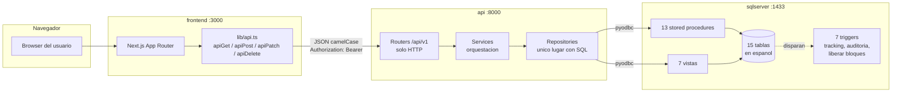
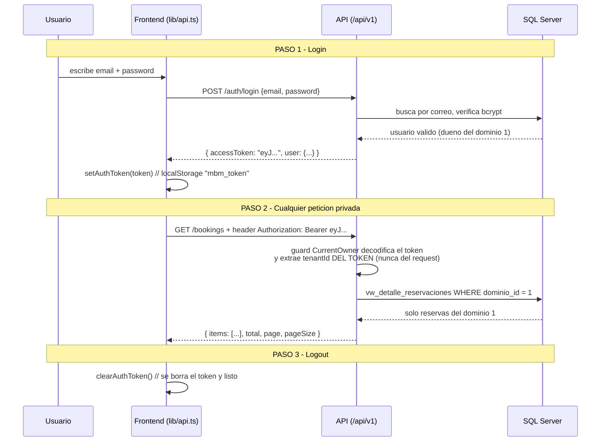
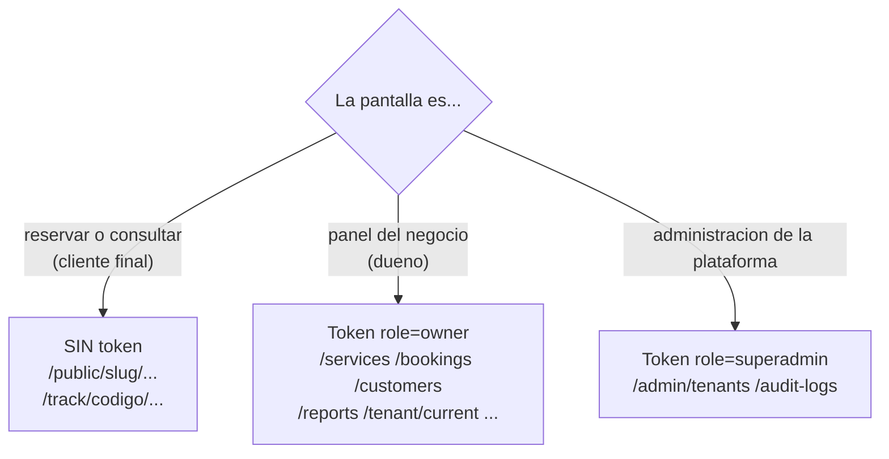

# Arquitectura visual — como se conecta todo

> Guia rapida para cualquier desarrollador del equipo. Los diagramas se renderizan
> automaticamente en GitHub. Version detallada de la API en [api-handover.md](api-handover.md).

## 1. El mapa completo en un vistazo

Tres contenedores orquestados por `docker compose up --build`:



Reglas de oro:

| Regla | Que significa |
|---|---|
| El frontend habla ingles | JSON camelCase (`serviceId`, `firstName`) |
| La base habla espanol | tablas/columnas (`servicios`, `nombre`) |
| La API traduce | los mappers convierten espanol -> camelCase, en un solo lugar |
| La logica vive en SQL | escrituras via stored procedures, lecturas via vistas |
| Los triggers hacen la magia | codigo de rastreo, auditoria y liberacion de bloques son AUTOMATICOS: nunca los programes en la API ni en el frontend |

## 2. Que puerto es que

| URL | Que hay ahi |
|---|---|
| http://localhost:3000 | Frontend Next.js |
| http://localhost:8000/api/v1/... | API (todos los endpoints) |
| http://localhost:8000/docs | OpenAPI interactivo (probar endpoints sin frontend) |
| localhost:1433 | SQL Server (DBeaver/Azure Data Studio, credenciales en `.env`) |

## 3. JWT en 3 pasos (asi funciona el login)



Dentro del token viajan tres datos: `sub` (id del usuario), `role` (`owner` o
`superadmin`) y `tenantId` (solo owners). Expira en 60 minutos; al expirar la API
devuelve 401 y el frontend debe redirigir al login.

## 4. Como se usa desde el codigo del frontend

Todo ya esta implementado en `apps/frontend/lib/api.ts`. Solo se usa asi:

```ts
// LOGIN (una sola vez): guarda el token
import { apiPost, setAuthToken } from "@/lib/api";
import { endpoints } from "@/lib/endpoints";

const res = await apiPost<LoginResponse>(endpoints.auth.login, {
  email, password, role: "owner",
});
setAuthToken(res.accessToken);   // queda en localStorage "mbm_token"
```

```ts
// CUALQUIER LLAMADA PRIVADA despues del login:
// el header Authorization: Bearer se agrega SOLO si hay token guardado
import { apiGet, apiPost } from "@/lib/api";

const page = await apiGet<Page<Booking>>("/bookings?page=1&pageSize=20");
const nuevo = await apiPost<Service>("/services", {
  categoryId: 1, name: "Corte premium", durationMinutes: 45,
});
```

```ts
// ERRORES: la API responde RFC 7807 y api.ts lo convierte en ApiError
try {
  await apiPost("/public/barberia-el-colocho/bookings", body);
} catch (e) {
  if (e instanceof ApiError && e.status === 409) {
    // el bloque ya fue reservado por otra persona
    mostrarMensaje(e.detail);
  }
}
```

```ts
// LOGOUT
import { clearAuthToken } from "@/lib/api";
clearAuthToken();
router.push("/login");
```

## 5. Publico vs privado — quien necesita token



- El flujo publico de reserva nunca pide login: el cliente recibe un **codigo de
  rastreo** (`MBM-XXXXXX`, lo genera un trigger) y con el consulta/cancela/reagenda.
- Un owner solo ve SU dominio: el `tenantId` sale del token, por eso es imposible
  pedir datos de otro negocio (la API responde 404).

## 6. Receta: conectar una pantalla nueva en 5 pasos

1. Busca el endpoint en [api-handover.md](api-handover.md) o en http://localhost:8000/docs.
2. Si no existe el tipo TS, agregalo en `apps/frontend/types/` (camelCase, igual al JSON).
3. Llama con los helpers de `lib/api.ts` (`apiGet`/`apiPost`/...) usando la constante de `lib/endpoints.ts`.
4. Si la pantalla es privada, no hagas nada especial: el Bearer se agrega solo si hay token; maneja el 401 redirigiendo a login.
5. Los listados vienen paginados: lee `res.items` y `res.total` (no asumas array plano).

## 7. Levantar todo desde cero (2 comandos)

```bash
cp .env.example .env          # y genera JWT_SECRET: openssl rand -hex 32
bash scripts/setup-db.sh      # SQL Server + 15 tablas + seed + SPs + vistas + triggers
docker compose up --build     # API :8000 + frontend :3000
```

Credenciales de prueba en `database/docs/PASSWORDS.md`. Dominio demo: `barberia-el-colocho`.
