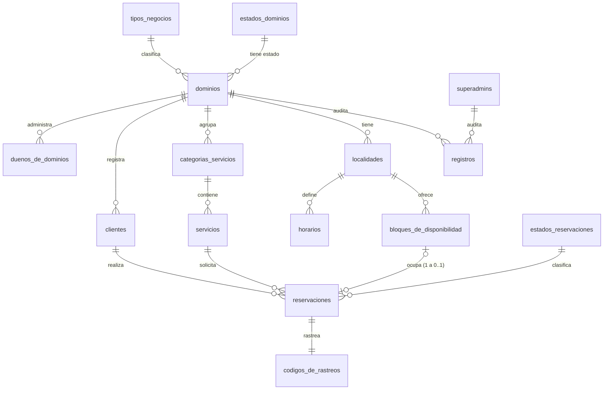
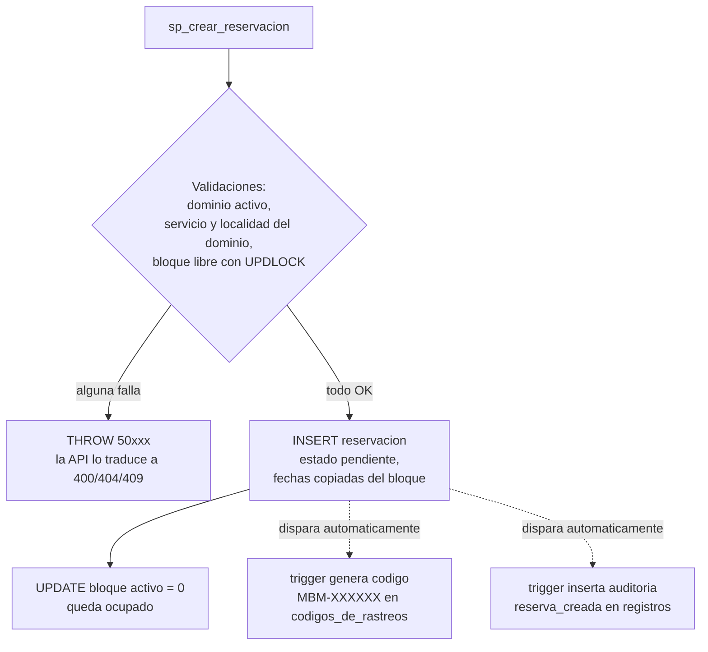
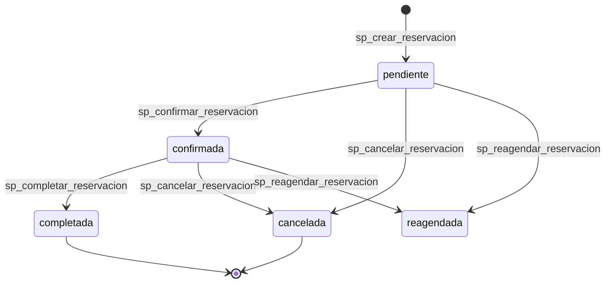
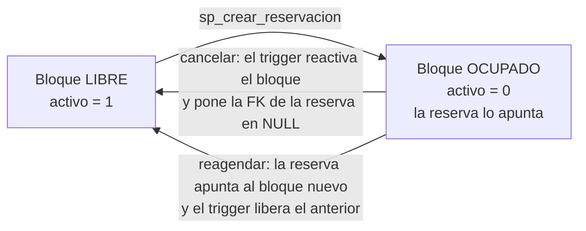

# Base de datos — como construido (as built)

> Este documento describe la base de datos TAL COMO QUEDO CONSTRUIDA en
> `database/scripts/` (verificable contra la instancia con `scripts/check-all.sql`).
> La propuesta de diseño original se conserva sin cambios en
> [database-and-sql.md](database-and-sql.md) para poder comparar y detectar
> diferencias. Firmas exactas de SPs/vistas/funciones en
> [sql-signatures.md](sql-signatures.md); equivalencia de nombres
> ingles / modelo MR / fisico ASCII en [rename-map.csv](rename-map.csv).

## Diferencias respecto a la propuesta (resumen para revision)

| Area | Propuesta | Como quedo construido |
| --- | --- | --- |
| Nombres de objetos SQL | Ingles (sp_create_booking, vw_booking_details...) | Espanol ASCII (sp_crear_reservacion, vw_detalle_reservaciones...) alineado al modelo MR del drawio |
| Procedimientos | 12 propuestos | 13 construidos (se agrego sp_confirmar_reservacion como transicion explicita) |
| Funciones | 6 propuestas | 6 construidas (mismos propositos, nombres en espanol) |
| Vistas | 6 propuestas | 7 construidas (se agrego vw_demanda_servicios para el reporte de demanda) |
| Triggers | 5-7 propuestos | 7 construidos |
| Side-effects (tracking, auditoria, liberar bloque) | El SP podia hacerlos o delegarlos | Regla anti-doble-efecto: viven UNICAMENTE en triggers; los SPs validan y orquestan |
| Bloque unico por reserva | UNIQUE simple implicito | Indice unico FILTRADO ux_reservaciones_bloque (permite multiples reservas canceladas con FK NULL) |
| Liberacion de bloque al cancelar | "Liberar el bloque" | El trigger reactiva el bloque Y pone la FK en NULL; el historial queda en fechas denormalizadas |
| Concurrencia | No especificada | sp_crear_reservacion y sp_reagendar_reservacion toman UPDLOCK/HOLDLOCK en transaccion |
| Errores de negocio | No especificados | THROW por rangos: 50001-50019 validacion, 50020-50039 no encontrado, 50040-50059 conflicto |
| Fechas de reserva/bloque | DATE + TIME separados | fecha_inicio/fecha_final DATETIME2 (fusion), fecha_de_bloque DATE se mantiene en bloques |
| Nombres de persona | full_name / first+last | nombre + apellido_1 + apellido_2 (apellido_2 opcional) |
| Seed | Ejemplos genericos (Barberia Elite, spa-luna) | 50 filas coherentes por tabla generadas por scripts/gen-seed.py (deterministico); reservas canceladas del seed liberan su bloque |
| Auditoria del seed y triggers | Acciones genericas | dominio_creado (seed), reserva_creada y reserva_actualizada (triggers) |

Todo lo demas (las 15 tablas, sus atributos, relaciones y la normalizacion)
se construyo igual que la propuesta, solo con los nombres fisicos en espanol.

## Tablas construidas

| Tabla | Proposito |
| --- | --- |
| tipos_negocios | Tipos de negocio permitidos. |
| estados_dominios | Estados posibles de un tenant. |
| superadmins | Administradores globales de la plataforma MBM. |
| dominios | Negocios registrados en MBM. |
| duenos_de_dominios | Duenos o administradores de cada tenant. |
| clientes | Clientes que realizan reservas. |
| categorias_servicios | Categorias de servicios por negocio. |
| servicios | Servicios ofrecidos por cada tenant. |
| localidades | Ubicacion o sede del negocio. |
| horarios | Horarios generales del negocio. |
| bloques_de_disponibilidad | Bloques disponibles para reservar. |
| estados_reservaciones | Estados posibles de una reserva. |
| reservaciones | Reservas realizadas. |
| codigos_de_rastreos | Codigos publicos para consultar reservas. |
| registros | Registro de acciones importantes (auditoria). |

Los atributos por tabla estan documentados en la propuesta
([database-and-sql.md](database-and-sql.md), seccion "Atributos por tabla") y
coinciden con lo construido en `database/scripts/02-create-tables.sql`, con
estas precisiones del as-built:

- reservaciones.bloque_disponibilidad_id es NULL-able con ON DELETE SET NULL y
  su unicidad se garantiza con el indice filtrado
  `ux_reservaciones_bloque (WHERE bloque_disponibilidad_id IS NOT NULL)`:
  un bloque solo puede estar tomado por una reserva a la vez, pero varias
  reservas canceladas/reagendadas conviven con FK NULL.
- fecha_inicio y fecha_final son DATETIME2 tanto en bloques_de_disponibilidad
  como en reservaciones (denormalizacion intencional para historial).
- Los identificadores fisicos son ASCII puro (duenos_de_dominios,
  contrasena_encriptada); la enie vive solo en el modelo MR del drawio.
- La base se llama mbm_booking, colacion Latin1_General_CI_AI (los DATOS si
  llevan acentos y enies).

## Diagrama de relaciones (vision rapida)

Version compacta para orientarse; el modelo completo esta en el drawio
(`infra/MultiTenantBookingManager.drawio`, tab MR) y el diagrama detallado en
el README. GitHub y el preview de VSCode renderizan este diagrama.



Como leerlo: todo cuelga de `dominios` (el negocio / tenant). La cadena del
flujo principal es: una localidad ofrece bloques, un cliente reserva un bloque
para un servicio, y cada reserva recibe un codigo de rastreo automatico.

## La vida de una reserva (con datos reales del seed)

Para entender como se conectan las tablas, seguimos la reserva 1 del seed a
traves de la base. Estas filas existen tal cual despues de correr los scripts
(verificable con `SELECT * FROM vw_detalle_reservaciones WHERE reserva_id = 1`).

Paso 1 — el contexto del negocio (dominio 1):

| tabla | fila real |
| --- | --- |
| dominios | id 1: Barberia El Colocho, slug barberia-el-colocho, estado activo |
| localidades | id 1: Sede Central (del dominio 1) |
| servicios | id 1: Corte de cabello hombre, 30 minutos |
| clientes | id 1: Juan Vargas Mora, juan.vargas@email.com, tel 8877-3001 |

Paso 2 — el bloque reservable y la reserva:

| tabla | fila real |
| --- | --- |
| bloques_de_disponibilidad | id 1: 2026-07-02 de 08:00 a 08:30, activo 0 (ocupado) |
| reservaciones | id 1: cliente 1 + servicio 1 + localidad 1 + bloque 1, estado pendiente, 2026-07-02 08:00 a 08:30 |
| codigos_de_rastreos | MBM-FMT01, expira 2026-08-01 |
| registros | accion reserva_creada sobre la reserva 1 |

Observa que la duracion de la reserva (08:00 a 08:30 = 30 min) coincide con
duracion_minutos del servicio, y que las fechas estan COPIADAS en la reserva
(denormalizacion intencional para conservar historial).

Que hace cada pieza cuando se crea una reserva por la API o por SP:



Las flechas punteadas son los triggers: nadie los llama, se disparan solos.
Por eso ni el SP ni la API insertan tracking ni auditoria (regla
anti-doble-efecto).

## Ciclo de vida de una reserva y su bloque

Estados reales de `estados_reservaciones` y quien registra cada transicion:



Cada transicion dispara el trigger de auditoria (reserva_actualizada, con el
estado anterior y el nuevo). La cancelacion ademas libera el bloque:



Ejemplo real en el seed: la reserva 3 (Spa La Garita, estado cancelada,
codigo MBM-RKD03) tiene bloque_disponibilidad_id NULL, pero conserva sus
fechas 2026-07-04 10:00 a 10:20 en las columnas denormalizadas; su bloque
(id 3) quedo activo = 1 y puede reservarse de nuevo. Asi el indice unico
filtrado permite que muchas reservas canceladas convivan sin chocar.

## Datos de prueba construidos (seed real)

Generados por `scripts/gen-seed.py` (deterministico, `--check` compara byte a
byte). 50 filas por tabla, semanticamente coherentes: cada reserva usa
cliente/servicio/localidad/bloque del mismo dominio y sus fechas coinciden con
el bloque.

Ejemplos reales del seed (utiles para probar):

- Slugs: barberia-el-colocho, salon-elegance, spa-la-garita, vet-san-jorge,
  clinica-santa-catalina. URL publica: /book/barberia-el-colocho
- Dominios: Barberia El Colocho, Salon Elegance, Spa La Garita, Veterinaria
  San Jorge, Clinica Santa Catalina.
- Servicios: Corte de cabello hombre, Corte de cabello mujer, Afeitado
  tradicional, Masaje relajante, Consulta general.
- Estados de dominio: pendiente, activo, suspendido, inactivo (+ relleno demo
  hasta 50 por el requisito R4).
- Estados de reserva: pendiente, confirmada, cancelada, completada, reagendada
  (+ relleno demo hasta 50).
- Las 10 reservas canceladas del seed tienen bloque_disponibilidad_id = NULL y
  su bloque activo = 1 (reservable de nuevo), replicando el efecto del trigger
  de liberacion.
- Credenciales de prueba: ver `database/docs/PASSWORDS.md`.

El patron del generador es facil de leer una vez que se ve: la reserva i usa
el cliente/servicio/localidad/bloque i del dominio i, las fechas avanzan un
dia por fila desde el ancla 2026-07-01, y los estados ciclan en orden
pendiente, confirmada, cancelada, completada, reagendada. Primeras 4 filas
reales:

| reserva | dominio | bloque | estado | fechas (copiadas del bloque) | codigo |
| --- | --- | --- | --- | --- | --- |
| 1 | Barberia El Colocho | 1 (ocupado) | pendiente | 2026-07-02 08:00 a 08:30 | MBM-FMT01 |
| 2 | Salon Elegance | 2 (ocupado) | confirmada | 2026-07-03 09:30 a 10:15 | MBM-LYL02 |
| 3 | Spa La Garita | NULL (liberado) | cancelada | 2026-07-04 10:00 a 10:20 | MBM-RKD03 |
| 4 | Veterinaria San Jorge | 4 (ocupado) | completada | 2026-07-05 11:30 a 11:55 | MBM-... |

La fila 3 es el caso interesante: cancelada, sin bloque (FK NULL) pero con sus
fechas historicas intactas — exactamente lo que el trigger de liberacion
produce en runtime.

## Scripts SQL construidos

```text
database/scripts/
├── 01-create-database.sql   crea mbm_booking desde cero
├── 02-create-tables.sql     15 tablas, PK/FK/UQ + indice filtrado
├── 03-seed-data.sql         seed generado por scripts/gen-seed.py
├── 04-procedures.sql        13 stored procedures
├── 05-functions.sql         6 funciones escalares
├── 06-views.sql             7 vistas multi-tabla
├── 07-triggers.sql          7 triggers
└── 08-full-script.sql       todo junto, una sola pasada sobre servidor limpio
```

Ejecucion: `bash scripts/setup-db.sh` (corre 01-07 en orden dentro del
contenedor) o el 08 completo en un solo shot. Verificacion:
`scripts/check-all.sql` imprime conteos por tabla y la matriz de requisitos
R3-R6; `scripts/smoke-db.sql` ejecuta 12 casos de humo re-ejecutables
(reserva, doble reserva rechazada, cancelacion con liberacion, etc.).

Nota para ejecucion manual: los scripts asumen QUOTED_IDENTIFIER ON (requisito
del indice filtrado). SSMS y Azure Data Studio lo traen ON por defecto; sqlcmd
requiere el flag -I (los scripts de setup ya lo incluyen).

## Procedimientos almacenados construidos (13)

En `database/scripts/04-procedures.sql`. Firmas completas con parametros y
codigos THROW en [sql-signatures.md](sql-signatures.md).

| Procedimiento | Proposito |
| --- | --- |
| sp_crear_dominio | Crear un dominio nuevo con estado inicial pendiente. |
| sp_activar_dominio | Activar un dominio desde superadmin. |
| sp_suspender_dominio | Suspender un dominio. |
| sp_crear_dueno | Crear business owner asociado a un dominio. |
| sp_crear_servicio | Crear un servicio (valida que la categoria pertenezca al dominio). |
| sp_actualizar_servicio | Actualizar un servicio. |
| sp_crear_bloque_disponibilidad | Crear un bloque (valida no-solapamiento en la localidad). |
| sp_crear_cliente | Crear o reutilizar un cliente por (dominio, correo). |
| sp_crear_reservacion | Crear una reserva publica o interna con bloqueo pesimista. |
| sp_confirmar_reservacion | Confirmar una reserva (valida transicion de estado). |
| sp_cancelar_reservacion | Cancelar una reserva. |
| sp_reagendar_reservacion | Reagendar una reserva a otro bloque. |
| sp_completar_reservacion | Marcar una reserva como completada. |

Errores de negocio con THROW por rangos (la API los traduce a HTTP):

| Rango | Significado | HTTP |
| --- | --- | --- |
| 50001-50019 | Validacion de negocio | 400 |
| 50020-50039 | No encontrado / no pertenece al dominio | 404 |
| 50040-50059 | Conflicto (bloque ocupado, solapamiento) | 409 |

sp_crear_reservacion (el critico) se encarga de:

- Validar que el dominio este activo y que servicio/localidad le pertenezcan.
- Tomar el bloque con SELECT ... WITH (UPDLOCK, HOLDLOCK) dentro de una
  transaccion (SET XACT_ABORT ON) y validar que este libre.
- Crear o reutilizar el cliente.
- Insertar la reserva con fechas copiadas del bloque, estado pendiente.
- Ocupar el bloque (activo = 0).
- NO genera tracking ni auditoria: eso lo hacen los triggers (regla
  anti-doble-efecto).

sp_cancelar_reservacion cambia el estado a cancelada validando la transicion;
la liberacion del bloque (activo = 1 y FK a NULL) y la auditoria las ejecutan
los triggers. sp_reagendar_reservacion toma el bloque nuevo con el mismo
bloqueo, lo ocupa y copia fechas; el trigger libera el anterior.

## Funciones SQL construidas (6)

En `database/scripts/05-functions.sql`.

| Funcion | Proposito |
| --- | --- |
| fn_generar_codigo_rastreo | Codigo unico MBM-XXXXXX desde una semilla UNIQUEIDENTIFIER (el trigger pasa NEWID(); alfabeto sin caracteres ambiguos 0/O/1/I). |
| fn_dominio_activo | 1 si el dominio existe, activo = 1 y estado 'activo'. |
| fn_bloque_disponible | 1 si el bloque existe, activo = 1 y sin reserva vigente. |
| fn_total_reservaciones_por_dominio | Total de reservas de un dominio. |
| fn_total_reservaciones_por_servicio | Total de reservas por servicio. |
| fn_duracion_reservacion | Duracion en minutos (DATEDIFF sobre fechas de la reserva). |

## Vistas SQL construidas (7)

En `database/scripts/06-views.sql`. Todas unen 2 o mas tablas (verificable
con sys.sql_expression_dependencies).

| Vista | Tablas | Proposito |
| --- | --- | --- |
| vw_detalle_reservaciones | 7 | Reservas con dominio, cliente, servicio, localidad, estado y tracking. |
| vw_dashboard_dominio | 6 | Resumen de reservas, clientes, servicios y localidades por dominio. |
| vw_agenda_diaria | 5 | Agenda diaria de reservas por dominio. |
| vw_estado_disponibilidad | 5 | Bloques disponibles y reservados por sede y fecha. |
| vw_historial_reservaciones_cliente | 4 | Historial de reservas por cliente. |
| vw_demanda_servicios | 3 | Total de reservas y ultima reserva por servicio. |
| vw_servicios_publicos | 3 | Servicios activos visibles en la pagina publica. |

## Triggers construidos (7)

En `database/scripts/07-triggers.sql`.

| Trigger | Proposito |
| --- | --- |
| trg_reservaciones_generar_rastreo | AFTER INSERT: genera el codigo de tracking (expira a 30 dias). Soporta insert multifila. |
| trg_reservaciones_auditar_insert | AFTER INSERT: registro de auditoria reserva_creada. |
| trg_reservaciones_auditar_update | AFTER UPDATE: auditoria reserva_actualizada cuando cambia el estado (con valor anterior y nuevo). |
| trg_dominios_actualizado_en | AFTER UPDATE: refresca actualizado_en (con guard anti-recursion). |
| trg_servicios_actualizado_en | AFTER UPDATE: refresca actualizado_en. |
| trg_prevenir_doble_reservacion | Defensa en profundidad: ROLLBACK + THROW 50043 si dos reservas activas apuntan al mismo bloque (el indice filtrado y el bloqueo del SP ya lo previenen; cubre INSERTs directos). |
| trg_liberar_bloque_al_cancelar | Al pasar a cancelada: reactiva el bloque y pone la FK en NULL (historial en fechas denormalizadas). Al reagendar: reactiva el bloque anterior. |

Regla de disenio (anti-doble-efecto): tracking, auditoria y liberacion de
bloques viven UNICAMENTE en triggers. Los stored procedures validan, bloquean
y orquestan, pero nunca duplican estos efectos. Verificable: no existe ningun
INSERT sobre codigos_de_rastreos ni registros dentro de 04-procedures.sql.

## Auditoria construida

Acciones que la implementacion genera en la tabla registros:

- dominio_creado — seed inicial (una por negocio).
- reserva_creada — trigger al insertar una reserva.
- reserva_actualizada — trigger en cada cambio de estado (confirmada,
  cancelada, completada, reagendada) con valor_anterior y nuevo_valor.

## Verificacion rapida

```sql
-- conteos y matriz R3-R6
-- (o ejecutar scripts/check-all.sql completo)
SELECT COUNT(*) FROM sys.tables;      -- 15
SELECT COUNT(*) FROM sys.procedures;  -- 13
SELECT COUNT(*) FROM sys.views;       -- 7
SELECT COUNT(*) FROM sys.triggers;    -- 7
SELECT COUNT(*) FROM sys.objects WHERE type IN ('FN','IF','TF');  -- 6
```
