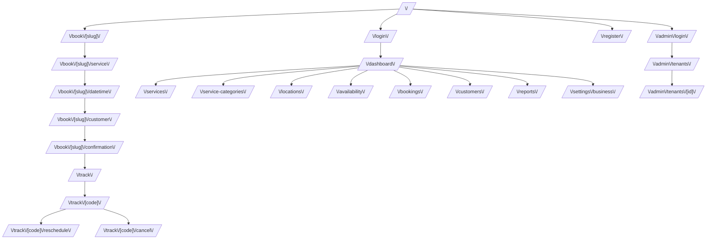

# Mapa de frontend

Mapa de rutas del frontend Citari y su relación con la API.

`/business-hours` existió como pantalla aparte y ahora **redirige** a
`/availability`: configurar el horario semanal y publicar los turnos
reservables se unificó en un solo flujo (ver más abajo).

## Relación frontend -> endpoint backend

- **Público**:
  - `/book/[slug]` usa `GET /public/{slug}`
  - `/book/[slug]/service` usa `GET /public/{slug}/services`
  - `/book/[slug]/datetime` usa `GET /public/{slug}/availability` (incluye `locationId` por bloque)
  - `/book/[slug]/customer` crea la reserva con `POST /public/{slug}/bookings` y navega a confirmación con el `trackingCode` real
  - `/track`, `/track/[code]` usan `GET /track/{code}`
  - `/track/[code]/cancel` usa `POST /track/{code}/cancel`
  - `/track/[code]/reschedule` usa `POST /track/{code}/reschedule`

- **Dueño de negocio** (todo cableado a la API real, con fallback a mock si `NEXT_PUBLIC_API_MODE=mock`):
  - `/dashboard` usa `GET /reports/dashboard` + `GET /bookings`
  - `/services` usa `GET/POST/PATCH/DELETE /services` (+ `GET /service-categories` para el selector)
  - `/service-categories` usa `GET/POST/PATCH/DELETE /service-categories`
  - `/locations` usa `GET/POST/PATCH/DELETE /locations`
  - `/availability` unifica dos cosas en una sola pantalla:
    - horario semanal por sede (`GET/PUT /business-hours?locationId=`)
    - generación de turnos reservables (`GET /availability-blocks`, `POST /availability-blocks` en lote, `DELETE /availability-blocks/{id}`), respetando el horario configurado y nunca generando turnos en el pasado
  - `/bookings` usa `GET /bookings` + `POST /bookings/{id}/{confirm,cancel,complete,reschedule}`
  - `/customers` usa `GET/POST /customers`
  - `/reports` usa `GET /reports/{dashboard,services-demand,availability-status}`
  - `/settings/business` usa `GET/PATCH /tenant/current`

- **Superadmin**:
  - `/admin/login` hace login con `role: "superadmin"` (distinto del `/login` de dueños, que siempre manda `role: "owner"`)
  - `/admin/tenants` usa `GET /admin/tenants` + `POST /admin/tenants/{id}/{activate,suspend}`
  - `/admin/tenants/[id]` usa `GET /admin/tenants/{id}`

## Estado de cableado

Todo el frontend consume la API real por defecto (`NEXT_PUBLIC_API_MODE=api`,
valor que ya trae el `docker-compose.yml` de desarrollo). El modo mock
(`NEXT_PUBLIC_API_MODE=mock`) sigue disponible como demo de diseño sin
backend, usando `lib/mock-data.ts`.

**Única limitación conocida**: el flujo público de reserva funciona
completo de punta a punta (crea una reserva real y devuelve un código de
seguimiento real). No hay pendientes de cableado en el back-office ni en el
panel de superadmin.
